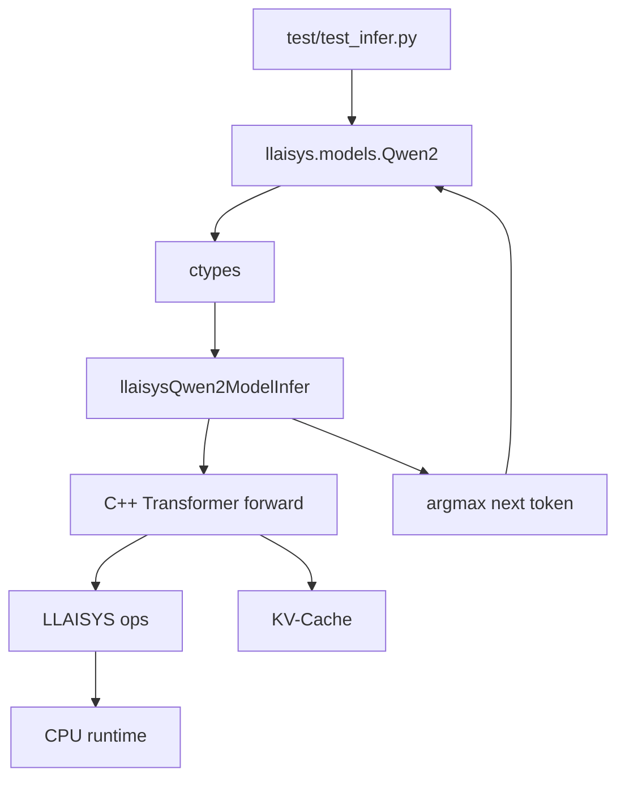

# 结果记录 3 - Qwen2 LLM 推理实现

## 任务本质

作业 #3 不是训练一个新的大模型，而是把前面已经实现的张量算子组合起来，形成一个可以加载真实 Qwen2 模型权重并执行推理的最小 LLAISYS 推理引擎。

完整数据流如下：

```text
token ids
  -> embedding
  -> Qwen2 Transformer blocks
  -> final RMSNorm
  -> lm_head linear
  -> argmax
  -> next token
```

本次实现针对本地模型：

```text
DeepSeek-R1-Distill-Qwen-1.5B
```

模型使用 28 层 Transformer、hidden size 1536、12 个 Query heads、2 个 Key/Value heads、head dim 128、intermediate size 8960、vocab size 151936，权重数据类型为 bfloat16。

## 修改文件

| 文件 | 操作 | 作用 |
|---|---|---|
| `src/llaisys/models/qwen2.cc` | 新建 | C++ Qwen2 模型对象、权重管理、KV-Cache 和前向推理 |
| `python/llaisys/models/qwen2.py` | 修改 | 读取配置和 safetensors，并通过 ctypes 调用 C API |
| `python/llaisys/libllaisys/__init__.py` | 修改 | 注册 Qwen2 的 ctypes 结构体和 C API |
| `xmake.lua` | 修改 | 将 `src/llaisys/models/*.cc` 加入共享库编译 |
| `src/llaisys/ops.cc` | 修改 | 允许 `linear` 接收空 bias |
| `python/llaisys/ops.py` | 修改 | Python 侧将 `bias=None` 传递为 C 的空指针 |
| `src/ops/rearrange/op.cpp` | 修改 | 实现同设备、同 dtype、同元素数量的连续内存复制 |

## 代码变化

### 1. Python 模型类

#### 修改前

```python
class Qwen2:

    def __init__(self, model_path, device: DeviceType = DeviceType.CPU):
        # TODO: Implement model constructor
        pass

    def generate(self, inputs, max_new_tokens, top_k, top_p, temperature):
        # TODO: Implement generate function
        return []
```

#### 修改后

```python
class Qwen2:
    def __init__(self, model_path, device: DeviceType = DeviceType.CPU):
        self.model_path = Path(model_path)
        self.device = DeviceType(device)

        with (self.model_path / "config.json").open(
            "r", encoding="utf-8"
        ) as file:
            config = json.load(file)

        self._meta = LlaisysQwen2Meta(
            dtype=_dtype_from_config(config),
            nlayer=int(config["num_hidden_layers"]),
            hs=int(config["hidden_size"]),
            nh=int(config["num_attention_heads"]),
            nkvh=int(config["num_key_value_heads"]),
            dh=int(config.get("head_dim", config["hidden_size"] // config["num_attention_heads"])),
            di=int(config["intermediate_size"]),
            maxseq=min(int(config["max_position_embeddings"]), 4096),
            voc=int(config["vocab_size"]),
            epsilon=float(config["rms_norm_eps"]),
            theta=float(config["rope_theta"]),
            end_token=int(config["eos_token_id"]),
        )

        self._model = LIB_LLAISYS.llaisysQwen2ModelCreate(
            ctypes.byref(self._meta), int(self.device), device_ids, 1
        )
        self._weights_ptr = LIB_LLAISYS.llaisysQwen2ModelWeights(self._model)
        self._load_weights(config)
```

构造函数现在会读取 `config.json`，建立和 C++ 一致的模型元数据，创建 C++ 模型对象，并加载全部 safetensors 权重。权重对应的 Tensor 对象保存在 `self._weight_tensors` 中，避免 Python 对象被回收后 C++ 仍然持有悬空句柄。

#### `generate` 修改后

```python
def generate(
    self,
    inputs: Sequence[int],
    max_new_tokens: int = None,
    top_k: int = 1,
    top_p: float = 0.8,
    temperature: float = 0.8,
):
    del top_k, top_p, temperature

    tokens = [int(token) for token in inputs]
    feed = tokens
    steps = 128 if max_new_tokens is None else int(max_new_tokens)

    for _ in range(steps):
        token_array = (ctypes.c_int64 * len(feed))(*feed)
        next_token = int(
            LIB_LLAISYS.llaisysQwen2ModelInfer(
                self._model, token_array, len(feed)
            )
        )
        tokens.append(next_token)
        if next_token == self._end_token:
            break
        feed = [next_token]

    return tokens
```

第一次调用使用完整输入序列执行 prefill；之后每次只传入上一步产生的一个 token，执行 decode。当前作业要求的是 `--test` 下的 greedy 推理，因此 `top_k`、`top_p` 和 `temperature` 暂时不参与采样。

### 2. C++ 模型对象和 C API

#### 修改前

`src/llaisys/models/qwen2.cc` 原来不存在，Python `Qwen2` 只有占位实现，无法创建模型、加载权重或推理。

#### 修改后

```cpp
struct LlaisysQwen2Model {
    LlaisysQwen2Meta meta{};
    LlaisysQwen2Weights weights{};

    std::vector<llaisys::tensor_t> kv_cache_k;
    std::vector<llaisys::tensor_t> kv_cache_v;
    size_t cache_capacity = 0;
    size_t total_kv_len = 0;

    llaisysDeviceType_t device = LLAISYS_DEVICE_CPU;
    int device_id = 0;
};
```

实现了头文件 `include/llaisys/models/qwen2.h` 声明的 4 个 C API：

```cpp
llaisysQwen2ModelCreate
llaisysQwen2ModelDestroy
llaisysQwen2ModelWeights
llaisysQwen2ModelInfer
```

它们分别负责创建模型、释放模型、返回权重结构体地址，以及输入 token ids 并返回下一个 token id。

### 3. Transformer 前向传播

核心前向函数 `llaisysQwen2ModelInfer` 的主要流程是：

```cpp
auto x = make_tensor(
    {seq, hs}, model->meta.dtype, model->device, model->device_id);
llaisys::ops::embedding(
    x, input_ids, unwrap(model->weights.in_embed, "in_embed"));

for (size_t l = 0; l < model->meta.nlayer; l++) {
    rms_norm(...)
    linear(q_flat, ...)
    linear(k_flat, ...)
    linear(v_flat, ...)
    rope(q, q, pos_ids, theta)
    rope(k, k, pos_ids, theta)
    copy_tensor(cache_k_write, k)
    copy_tensor(cache_v_write, v)
    self_attention(...)
    linear(attn_proj, ...)
    add residual
    rms_norm(...)
    linear(gate, ...)
    linear(up, ...)
    swiglu(...)
    linear(down, ...)
    add residual
}

rms_norm(final_norm, last, ...)
linear(logits, final_norm, lm_head, nullptr)
argmax(max_idx, max_val, logits)
```

逐步解释：

| 步骤 | 作用 |
|---|---|
| `embedding` | 将 token id 查表转换为 hidden vector |
| `rms_norm` | 对每个 Transformer block 的输入做 RMSNorm |
| `linear(q/k/v)` | 产生 Query、Key、Value |
| `view` | 把线性层输出重新解释为 `[seq, heads, head_dim]` |
| `rope` | 根据 token 位置对 Q、K 加入旋转位置编码 |
| `copy_tensor` | 将本次 K/V 写入对应层的 KV-Cache |
| `self_attention` | 使用当前 Q 和历史、当前 K/V 计算注意力结果 |
| 第一处 residual add | 完成注意力子层残差连接 |
| 第二次 `rms_norm` | 归一化进入 MLP 子层的数据 |
| `gate/up` | 产生 SwiGLU 的两个输入分支 |
| `swiglu` | 执行门控激活 |
| `down` | 将 MLP 中间维度投影回 hidden size |
| 第二处 residual add | 完成 MLP 子层残差连接 |
| final `rms_norm` | 处理最后一个 token 的 hidden state |
| `lm_head linear` | 将 hidden state 投影为词表大小的 logits |
| `argmax` | 选择 logits 最大的词表索引作为下一个 token |

### 4. KV-Cache

#### 设计

```cpp
kv_cache_k[layer] = [cache_length, num_key_value_heads, head_dim]
kv_cache_v[layer] = [cache_length, num_key_value_heads, head_dim]
total_kv_len      = 已经写入缓存的 token 数
```

prefill 时一次处理完整 prompt，并将所有 K/V 写入缓存；decode 时每次只计算新 token 的 Q/K/V，将新的 K/V 追加到缓存，再让当前 Q 访问全部历史 K/V。

缓存采用按需扩容：初始容量较小，长度不足时扩大到当前需要长度或原容量的两倍，但不超过 `maxseq`。Python 侧将测试缓存上限限制为 4096，避免为了验证短文本而提前分配 131072 长度的缓存。

### 5. ctypes C API 注册

#### 修改前

```python
load_runtime(LIB_LLAISYS)
load_tensor(LIB_LLAISYS)
load_ops(LIB_LLAISYS)
```

#### 修改后

```python
load_runtime(LIB_LLAISYS)
load_tensor(LIB_LLAISYS)
load_ops(LIB_LLAISYS)
load_qwen2(LIB_LLAISYS)
```

`load_qwen2` 为 `Create`、`Destroy`、`Weights`、`Infer` 设置 `argtypes` 和 `restype`，使 Python 可以正确传递模型元数据、指针和 token 数量。

### 6. 其他必要修复

#### `linear` 的可选 bias

修改前 C 包装层直接访问 `bias->tensor`，当调用方不需要 bias 并传入空指针时会发生空指针解引用。

```diff
- llaisys::ops::linear(out->tensor, in->tensor, weight->tensor,
-                      bias->tensor);
+ llaisys::ops::linear(
+     out->tensor, in->tensor, weight->tensor,
+     bias == nullptr ? nullptr : bias->tensor);
```

Python 侧同步改为：

```python
None if bias is None else bias.lib_tensor()
```

这样 Qwen2 的无 bias 投影可以正常工作。

#### `rearrange`

修改前：

```cpp
void rearrange(tensor_t out, tensor_t in) {
    TO_BE_IMPLEMENTED();
}
```

修改后：

```cpp
CHECK_SAME_DEVICE(out, in);
CHECK_ARGUMENT(out->dtype() == in->dtype(), "rearrange: dtype mismatch");
CHECK_ARGUMENT(out->numel() == in->numel(),
               "rearrange: element count mismatch");
ASSERT(out->isContiguous() && in->isContiguous(),
       "rearrange: tensors must be contiguous");

core::context().setDevice(out->deviceType(), out->deviceId());
const size_t bytes = out->numel() * out->elementSize();
const auto kind = out->deviceType() == LLAISYS_DEVICE_CPU
                      ? LLAISYS_MEMCPY_H2H
                      : LLAISYS_MEMCPY_D2D;
core::context().runtime().api()->memcpy_sync(
    out->data(), in->data(), bytes, kind);
```

该实现用于同设备、同类型、同元素数量连续 Tensor 的数据复制，保证相关算子链可以完成布局转换后的数据传递。

#### xmake

```diff
  add_files("src/llaisys/*.cc")
+ add_files("src/llaisys/models/*.cc")
```

因此新建的 `qwen2.cc` 会被编译进 `llaisys` 共享库，并在 `xmake install` 后复制到 Python 包的 `libllaisys` 目录。

## 推理调用关系



Python 负责模型文件读取、权重映射和生成循环；C++ 负责模型结构和前向计算；算子层负责具体 Tensor 运算；运行时负责实际设备内存和数据复制。

## 验证结果

### 构建共享库

```powershell
D:\LLAISYS\env\xmake\xmake.exe
D:\LLAISYS\env\xmake\xmake.exe install
```

结果：构建成功，并将 DLL 安装到：

```text
python/llaisys/libllaisys/llaisys.dll
```

### 权重加载

```powershell
$env:PYTHONPATH='D:\LLAISYS\code\llaisys-26s\python'
D:\LLAISYS\env\python\.venv\Scripts\python.exe -c "import llaisys; m=llaisys.models.Qwen2(r'D:\LLAISYS\models\DeepSeek-R1-Distill-Qwen-1.5B', llaisys.DeviceType.CPU); print('created', len(m._weight_tensors))"
```

结果：

```text
created 339
```

说明本地模型的 339 个 safetensors 权重均已成功读取并映射到 C++ 权重结构。

### 端到端推理测试

```powershell
$env:PYTHONPATH='D:\LLAISYS\code\llaisys-26s\python'
D:\LLAISYS\env\python\.venv\Scripts\python.exe test/test_infer.py --model D:\LLAISYS\models\DeepSeek-R1-Distill-Qwen-1.5B --test --max_steps 1
```

结果：`Test passed!`，LLAISYS 和 HuggingFace 的 token 序列一致。

```powershell
$env:PYTHONPATH='D:\LLAISYS\code\llaisys-26s\python'
D:\LLAISYS\env\python\.venv\Scripts\python.exe test/test_infer.py --model D:\LLAISYS\models\DeepSeek-R1-Distill-Qwen-1.5B --test --max_steps 10
```

结果：`Test passed!`，连续生成 10 个 token 时，LLAISYS 与 HuggingFace 的完整 token 序列逐 token 一致。

测试耗时记录：

```text
max_steps 1: 约 13.82 秒
max_steps 10: 约 28.05 秒
```

额外检查：

```powershell
git diff --check
D:\LLAISYS\env\xmake\xmake.exe
```

结果：`git diff --check` 通过，`xmake` 显示 `build ok`。

### 依赖安装说明

`pip install ./python/` 在当前环境中曾因网络无法下载构建依赖 `setuptools>=42` 而失败。这是安装阶段的网络/依赖下载问题，不是本次 C++ 或 Python 实现的运行错误。使用项目源码路径：

```powershell
$env:PYTHONPATH='D:\LLAISYS\code\llaisys-26s\python'
```

进行测试后，导入、权重加载和端到端推理均已通过。

## 结论

作业 #3 已完成。LLAISYS 现在具备一个可运行的 CPU Qwen2 推理路径，能够：

1. 通过 Python 读取 Qwen2 配置和 safetensors 权重。
2. 通过 ctypes 调用 C API 创建和管理 C++ 模型。
3. 使用已有 embedding、RMSNorm、RoPE、self-attention、SwiGLU、linear、add、argmax 等算子完成 Transformer 前向传播。
4. 使用 KV-Cache 支持 prompt prefill 和逐 token decode。
5. 在 greedy 测试模式下与 HuggingFace 结果逐 token 对齐。

当前验证重点是 CPU 路径；NVIDIA/GPU 路径仍取决于已有 CUDA runtime 和对应 GPU 算子实现。
